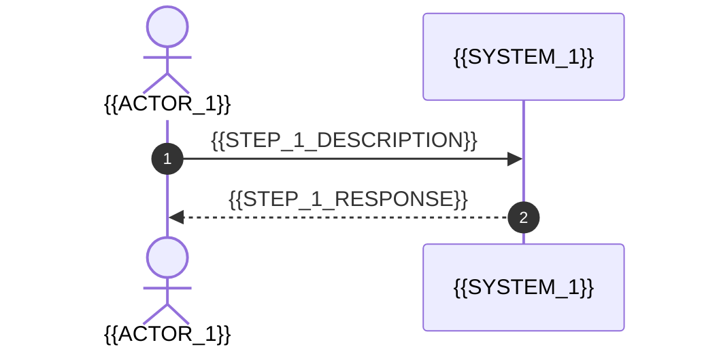

# Phase {{PHASE_NUMBER}}: {{PHASE_NAME}}

**Status: {{DOCUMENT_STATUS}}**

{{PHASE_NUMBER}}.1. Phase {{PHASE_NUMBER}} Flow Diagram
```mermaid
graph TD
    P{{PHASE_NUMBER}}_Start[<start> {{PHASE_NUMBER}}.0 {{START_NAME}}]
    P{{PHASE_NUMBER}}_End[<end> {{PHASE_NUMBER}}.8 {{END_NAME}}]

    P{{PHASE_NUMBER}}_Start --> Actor1[{{ACTOR_1}}]
    Actor1 -->|{{STEP_1}}| Sys1[{{SYSTEM_1}}]
    
    Sys1 --> P{{PHASE_NUMBER}}_End

    %% Styling
    linkStyle 0,1,2 stroke:#3b82f6,stroke-width:2px;

    classDef actor fill:#fff7ed,stroke:#fb923c,stroke-width:2px;
    classDef component fill:#f0fdf4,stroke:#4ade80,stroke-width:2px;
    classDef data fill:#f5f3ff,stroke:#a78bfa,stroke-width:2px;
    classDef startend fill:#eab30880,stroke:#eab308,stroke-width:3px;

    class Actor1 actor;
    class Sys1 component;
    class P{{PHASE_NUMBER}}_Start,P{{PHASE_NUMBER}}_End startend;
```

{{PHASE_NUMBER}}.2. Phase {{PHASE_NUMBER}} Sequence Diagram


### {{PHASE_NUMBER}}.3. Phase {{PHASE_NUMBER}}: Key Requirements
> [!NOTE] 
> **{{REQUIREMENT_1_TITLE}}**
> {{REQUIREMENT_1_DESC}}

> [!IMPORTANT]
> **{{REQUIREMENT_2_TITLE}}**
> {{REQUIREMENT_2_DESC}}

---
**Navigation:**
*   **Previous Phase:** [[hld-p{{PREV_PHASE_NUMBER}}-{{PREV_PHASE_SLUG}}|Phase {{PREV_PHASE_NUMBER}}: {{PREV_PHASE_NAME}}]]
*   **Back to:** [[hld-macro-overview|Macro Architecture Overview]]
*   **Next Phase:** [[hld-p{{NEXT_PHASE_NUMBER}}-{{NEXT_PHASE_SLUG}}|Phase {{NEXT_PHASE_NUMBER}}: {{NEXT_PHASE_NAME}}]]
*   **Reference:** [[hld-footer|HLD Footer (KADs, Risks, NFRs)]]
