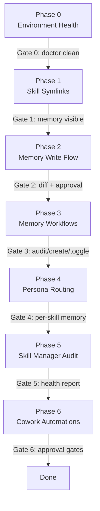

# Skill Forge Verification Plan

A phased, gated guide. Each phase ends with a confirmation gate — only proceed when you are satisfied. Signal readiness with: **"Phase N done — move on"** or flag any issues for triage before continuing.

---

## How to use this file

**This is the canonical copy** in the repo (`raw/testing/verification-plan.md`). At the start of a new session, use the **Session resume prompt** below. Keep the **Progress tracker** table in sync with reality (edit this file, then commit).

---

## Session resume prompt

Copy and paste this at the start of any new chat session:

```
Read raw/testing/verification-plan.md. We are working through the Skill Forge
verification plan. Check the progress table and tell me which phase we are on,
what was last completed, and what the next step is. Wait for my confirmation
before doing anything.
```

---

## Progress tracker

Update this table as each phase is completed. Mark the status column and add a one-line outcome note.

| Phase | Title | Status | Outcome / Notes |
|-------|-------|--------|-----------------|
| 0 | Environment Health Check | `done` | Fixed install_dir (old path → ~/.skillmanager), re-ran install.py, all 16 skills OK |
| 1 | Skill Symlinks and Visibility | `done` | Skills visible in Cursor agent; symlinks match after ~/.skillmanager install |
| 2 | Memory Skill: Basic Write + Approval Flow | `done` | 2a: no-op on existing fact; 2b: global scope confirmed, wrote to install_dir/model.md; 2c: archive comment used, restored after |
| 3 | Memory Skill: Audit + Create + Toggle | `pending` | |
| 4 | Memory Routing: Per-Skill Persona Files | `pending` | |
| 5 | Skill Manager: Skill Health | `pending` | |
| 6 | Knowledge OS Cowork Automations | `pending` | |

Status values: `pending` → `in-progress` → `done` or `blocked: <reason>`

---

## Phase 0 — Environment Health Check

**Goal:** Confirm the Skill Forge install is intact before testing anything else.

Run each command and check the expected output:

```bash
skillmanager doctor        # should report all tools found, no PATH errors
skillmanager config        # should show SKILLMANAGER_DIR, LLM targets (claude etc.)
skillmanager version       # should print a version string
skillmanager ls            # should list all 16 skills with their metadata.status
skillmanager status        # should confirm symlinks match metadata.status
```

What to watch for:
- `doctor` flags missing tools (git, gh, gcloud, terraform) — note any gaps
- `config` confirms `~/.skillmanager/config.yaml` exists and `install_dir` is a real path (e.g. `~/.skillmanager`)
- `ls` shows all skills; any unexpected `deactivated` or missing entries
- `status` shows no mismatched symlinks (if it does, run `skillmanager audit` to fix)

Key files checked implicitly:
- [`scripts/skillmanager.py`](../../scripts/skillmanager.py) — the CLI
- `~/.skillmanager/config.yaml` — install config

> **Gate 0:** Confirm `doctor` is clean and all 16 skills are visible in `ls`. Flag any red flags before proceeding.

**Phase 0 notes** _(fill in during testing)_:
- [ ] `doctor` clean
- [ ] `config` shows correct `install_dir`
- [ ] `ls` shows 16 skills
- [ ] `status` shows no mismatched symlinks
- Findings:

---

## Phase 1 — Skill Symlinks and Visibility

**Goal:** Confirm LLM clients (Cursor, Claude Code, Cowork) can see the skills.

Steps:
1. Locate your LLM skills dir: `skillmanager config` will show the path (typically `~/.claude/skills/`)
2. List the symlinks there: `ls -la ~/.claude/skills/`
3. Verify at least the key skills are symlinked: `memory`, `skill-manager`, `vault-paths`, `documenter`, `git`
4. If any are missing, run `skillmanager audit` to reconcile

In Cursor, attach skills from the skills picker. In Claude Code, skills load per product behavior.

> **Gate 1:** Confirm skills are visible. Confirm `memory` skill is reachable when you need it.

**Phase 1 notes** _(fill in during testing)_:
- [ ] `~/.claude/skills/` contains correct symlinks
- [ ] `memory` skill symlink exists and is not broken
- [ ] Skills visible/attachable in Cursor (or your primary client)
- Findings:

---

## Phase 2 — Memory Skill: Basic Write + Approval Flow

**Goal:** Verify the end-to-end memory write cycle works correctly with diff + approval.

The [`../../skills/brain-manager/SKILL.md`](../../skills/brain-manager/SKILL.md) core workflow:
1. Detect trigger phrase → identify target file → show diff → write only on "yes"

**Test 2a — Project memory (CLAUDE.md)**

In your agent, say:

> "Remember that in this project we always use kebab-case for skill directory names."

Expected behaviour:
- Agent reads the current project `CLAUDE.md` (or notes it doesn't exist)
- Shows a **before/after diff** proposing to add the fact
- Does NOT write until you say "yes"
- After approval: confirms `Memory updated: <path>`

**Test 2b — User-global memory**

> "Going forward, I prefer concise responses without bullet-point overuse. Add this as a global rule."

Expected:
- Agent flags this as **user-global** scope (high impact), asks you to confirm scope
- Targets `~/.claude/CLAUDE.md` (or equivalent)
- Shows diff and waits for approval

**Test 2c — Memory removal with archive**

> "Forget the rule about kebab-case I just added."

Expected:
- Agent shows a diff that comments out the line: `<!-- archived: YYYY-MM-DD: user removed -->`
- Does not silently delete

> **Gate 2:** Confirm write, scope confirmation, and archive flows all behave correctly and require approval at each step.

**Phase 2 notes** _(fill in during testing)_:
- [x] 2a: project memory write triggered diff + approval
- [x] 2b: global memory flagged scope and required confirmation
- [x] 2c: removal used archive comment, did not silently delete
- Findings: global scope routes to `~/.skillmanager/model.md` (not `llm/*.md`); 2a correctly detected existing fact and skipped write

---

## Phase 3 — Memory Skill: Audit + Create + Toggle Workflows

**Goal:** Verify the three memory sub-workflows function as documented.

**Test 3a — memory-audit**

> "Run memory-audit — list all memory files and their contents."

This invokes [`../../skills/brain-manager/workflows/brain-audit.md`](../../skills/brain-manager/workflows/brain-audit.md). Expected:
- Lists project `CLAUDE.md`, user `~/.claude/CLAUDE.md`, any `persona/*.md` files
- Shows their contents or line counts; flags oversized files (>40 lines)

**Test 3b — memory-create (stub scaffolding)**

> "Create a new per-skill memory stub for the `development-engineer` skill, topic: python-preferences."

This invokes [`../../skills/brain-manager/workflows/brain-create.md`](../../skills/brain-manager/workflows/brain-create.md). Expected:
- Proposes creating `development-engineer/persona/python-preferences.md` under your installed skills tree (e.g. `~/.skillmanager/skills/...`)
- Shows the stub content, writes only on approval

**Test 3c — memory-system-toggle**

> "Show me how to toggle the memory skill between always-on and manual modes."

This invokes [`../../skills/brain-manager/workflows/brain-system-toggle.md`](../../skills/brain-manager/workflows/brain-system-toggle.md). Expected:
- Explains the `system-skills-always-on.md` vs `system-skills-manual.md` persona files
- Shows what would need to change, with your approval required before any edit

> **Gate 3:** Confirm all three workflows are reachable and behave correctly.

**Phase 3 notes** _(fill in during testing)_:
- [ ] 3a: memory-audit listed all memory files
- [ ] 3b: memory-create proposed stub and waited for approval
- [ ] 3c: memory-system-toggle explained modes without auto-editing
- Findings:

---

## Phase 4 — Memory Routing: Per-Skill Persona Files

**Goal:** Validate the persona routing works for existing skills that use `persona/`.

Example source paths in this repo (same layout under `~/.skillmanager/skills/` after install):
- [`../../skills/development-engineer/persona/python.md`](../../skills/development-engineer/persona/python.md)
- [`../../skills/development-engineer/persona/react.md`](../../skills/development-engineer/persona/react.md)

**Test 4a — Read a persona file**

> "Show me the contents of my python persona memory."

Expected: reads `.../development-engineer/persona/python.md` and displays it.

**Test 4b — Update a persona file**

> "Remember, for Python work I prefer type hints on all function signatures. Update my python persona memory."

Expected:
- Memory skill routes to `development-engineer/persona/python.md`
- Shows before/after diff
- Writes only on approval

> **Gate 4:** Confirm persona routing is working. Confirm you are satisfied with how facts are segmented (project vs global vs per-skill).

**Phase 4 notes** _(fill in during testing)_:
- [ ] 4a: read `python.md` correctly
- [ ] 4b: memory update routed to persona file, showed diff, required approval
- Findings:

---

## Phase 5 — Skill Manager: Skill Health

**Goal:** Use `skill-manager` to audit your installed skills for quality and consistency.

**Test 5a — Skills audit**

> "Run the skills audit workflow — check all active skills for compliance."

This invokes [`../../skills/skill-manager/workflows/skills-audit.md`](../../skills/skill-manager/workflows/skills-audit.md). Expected:
- Iterates through each active skill
- Checks for required front matter (`name`, `description`, `metadata.status`)
- Reports any gaps without auto-fixing

**Test 5b — Review one skill**

> "Review the `memory` skill — is it complete and compliant?"

This invokes [`../../skills/skill-manager/workflows/skills-review-one.md`](../../skills/skill-manager/workflows/skills-review-one.md).

> **Gate 5:** Confirm skill-manager can audit skills and report issues correctly. No fixes needed — just visibility.

**Phase 5 notes** _(fill in during testing)_:
- [ ] 5a: skills-audit ran and reported any front matter gaps
- [ ] 5b: review-one on `memory` returned a compliance verdict
- Findings:

---

## Phase 6 — Knowledge OS Cowork Automations

**Goal:** Verify the three Cowork scheduled task definitions are correctly configured for your environment.

> Pre-condition: you need `OBSIDIAN_ROOT` and `OBSIDIAN_META` set (check `knowledge-os/knowledge-os.env.example`). If Obsidian is not yet set up, skip this phase.

**Test 6a — Environment check**

```bash
skillmanager knowledge-os   # checks OBSIDIAN_ROOT, OBSIDIAN_META, wiki-harvest and vault-paths symlinks
```

Expected: no errors; confirms the two required skills are symlinked.

**Test 6b — Inbox Process task**

Review [`../../knowledge-os/cowork/task-inbox-process.txt`](../../knowledge-os/cowork/task-inbox-process.txt). Steps:
1. Paste the task content into Claude Cowork (or run manually)
2. Set your real `OBSIDIAN_ROOT` and `OBSIDIAN_META` paths in the placeholders
3. Run against a small test inbox (1-2 notes)
4. Confirm it stops after listing pending items and waits for your approval before moving files

**Test 6c — Super Wiki Refresh task**

Review [`../../knowledge-os/cowork/task-super-wiki-refresh.txt`](../../knowledge-os/cowork/task-super-wiki-refresh.txt). Same process — configure paths, run on a test vault, confirm incremental sync and no auto-edits to `meta/wiki/`.

**Test 6d — Wiki Harvest Refresh**

Review [`../../knowledge-os/cowork/task-wiki-harvest-refresh.txt`](../../knowledge-os/cowork/task-wiki-harvest-refresh.txt). Confirm triage of curated pages by status emoji, and that sprint card drafts require your approval.

> **Gate 6:** Confirm at least `skillmanager knowledge-os` passes clean. For each Cowork task, confirm the approval gate works (it stops and waits, does not auto-move/edit).

**Phase 6 notes** _(fill in during testing)_:
- [ ] 6a: `skillmanager knowledge-os` passed with no errors
- [ ] 6b: inbox-process stopped before moving files, waited for approval
- [ ] 6c: super-wiki-refresh ran incrementally, did not auto-edit `meta/wiki/`
- [ ] 6d: wiki-harvest triage required approval for sprint card drafts
- Findings:

---

## Keeping the plan alive

After completing each phase:
1. Update the **Progress tracker** table above (change `pending` → `done`)
2. Fill in the **Phase N notes** checklist
3. Update the `todos` in the YAML frontmatter of this file to match
4. Commit this file to git so progress is version-controlled:

```bash
git add raw/testing/verification-plan.md
git commit -m "chore: verification plan — phase N complete"
```

If you need to hand off or resume in a new session, use the **Session resume prompt** at the top of this file.

## Summary: Phase Order and Gates



**Signal phrases to use during the session:**
- "Phase N done — move on" → advance to next phase
- "Phase N issue: [description]" → triage before proceeding
- "Skip Phase N" → skip an optional phase (6 is optional if no Obsidian)
